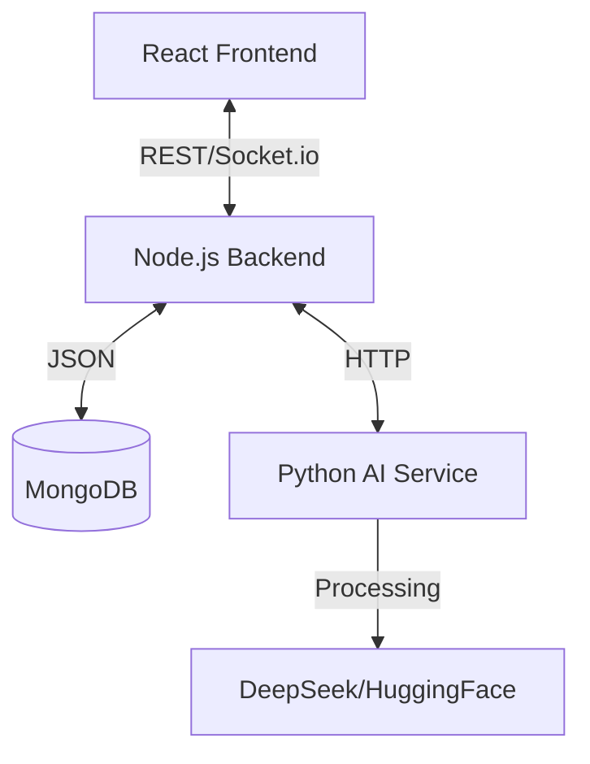

# Smart Project Manager

**Smart Project Manager** is your intelligent workspace for getting things done. It combines the visual simplicity of tools like Trello with the power of **Artificial Intelligence** to automate your workflow.

Instead of manually creating every single task, you can simply **chat with the AI** or **upload a project document**, and the system will automatically build your project plan for you. It's designed to save you time on administration so you can focus on actual work.

**Key capabilities at a glance:**
- **Organize:** Manage projects with Boards, Lists, Timelines, and Calendars.
- **Automate:** Let the AI break down big goals into manageable tasks.
- **Collaborate:** See updates instantly as your team works together.


*(Place your dashboard screenshot here)*

## 🚀 Key Features

### 🧠 AI-Powered Intelligence
*   **Smart Task Creation:** Type natural language commands or upload PDF documents to automatically generate structured tasks and project plans.
*   **AI Chat Assistant:** A floating chatbot that understands context, answers queries, and helps manage your workflow.
*   **Automated Analysis:** Analyze project descriptions to get instant insights, tag suggestions, and sentiment analysis.

### ⚡ Comprehensive Project Management
*   **Dynamic Views:** Switch seamlessly between **Kanban Board** (Drag & Drop), **List View**, and **Timeline View**.
*   **Interactive Calendar:** Visualise deadlines and events with a fully integrated calendar system.
*   **Real-Time Ops:** Instant updates across all clients using Socket.io.

### 🎨 Premium User Experience
*   **Modern UI:** Built with **TailwindCSS** and **Framer Motion** for glassmorphism effects, smooth transitions, and a dark-mode-first aesthetic.
*   **Drag & Drop:** Powered by `@dnd-kit` for a buttery smooth task management experience.

### 🔌 Integrations
*   **Google Calendar:** Sync events directly with your task timelines.
*   **Slack:** Receive real-time notifications and updates via webhooks.

---

## 🏗️ Architecture

The application is built using a robust **Microservices Architecture**:

1.  **Frontend (Client):** A React Single Page Application (SPA) built with Vite.
2.  **Main Backend (API):** A Node.js/Express REST API handling core logic, auth, and database interactions.
3.  **AI Service (Microservice):** A dedicated Python/Flask service leveraging LangGraph and LLMs (DeepSeek/HuggingFace) for heavy AI processing.



---

## 🛠️ Tech Stack

### Frontend
*   **Framework:** React 19 (Vite)
*   **Styling:** TailwindCSS 4, Framer Motion
*   **State/Data:** Axios, React Context
*   **Tools:** dnd-kit, React Big Calendar, React Icons

### Backend (Core)
*   **Runtime:** Node.js
*   **Framework:** Express.js
*   **Database:** MongoDB (Mongoose)
*   **Auth:** Passport.js (Google OAuth), JWT
*   **Real-time:** Socket.io

### AI Service
*   **Framework:** Flask (Python)
*   **AI/ML:** LangGraph, LangChain, HuggingFace
*   **Tools:** Pandas, NumPy

---

## 🚀 Getting Started

### Prerequisites
*   Node.js (v18+)
*   Python (3.9+)
*   MongoDB (Local or Atlas URI)

### 1. clone the Repository
```bash
git clone https://github.com/Start-Project-Manager/Smart-Project-Manager.git
cd Smart-Project-Manager
```

### 2. Setup Backend
```bash
cd backend
npm install
# Create a .env file based on .env.example
# Required: PORT, MONGO_URI, JWT_SECRET, GOOGLE_CLIENT_ID, etc.
npm run dev
```
*Backend runs on `http://localhost:5000` (default)*

### 3. Setup AI Service
```bash
cd ../ai-service
python -m venv .venv
source .venv/bin/activate  # On Windows: .venv\Scripts\activate
pip install -r requirements.txt
# Create a .env file with your AI API Keys (DEEPSEEK_API_KEY, etc.)
python app.py
```
*AI Service runs on `http://localhost:5001`*

### 4. Setup Frontend
```bash
cd ../frontend
npm install
npm run dev
```
*Frontend runs on `http://localhost:5173`*

---

## 📸 Screenshots

| Kanban Board | AI Chat |
|:---:|:---:|
|  |  |

| Calendar View | Settings |
|:---:|:---:|
|  |  |

*(Note: Add actual screenshot files to a `docs/screenshots` folder in your repo to make these visible)*

## 📄 API Documentation

The backend exposes a comprehensive RESTful API.

*   `POST /api/auth/signup` - Register User
*   `POST /api/auth/login` - Login User
*   `GET /api/projects` - Get All Projects
*   `POST /api/projects/ai/command` - AI Task Generation
*   `POST /api/tasks` - Create Task

